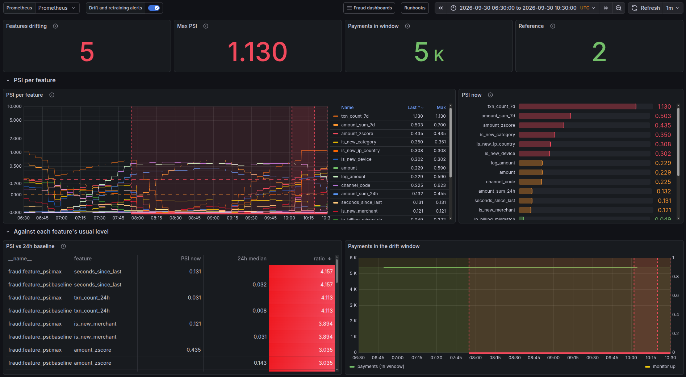
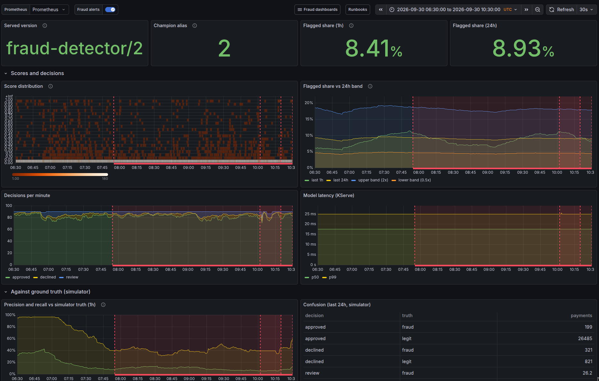
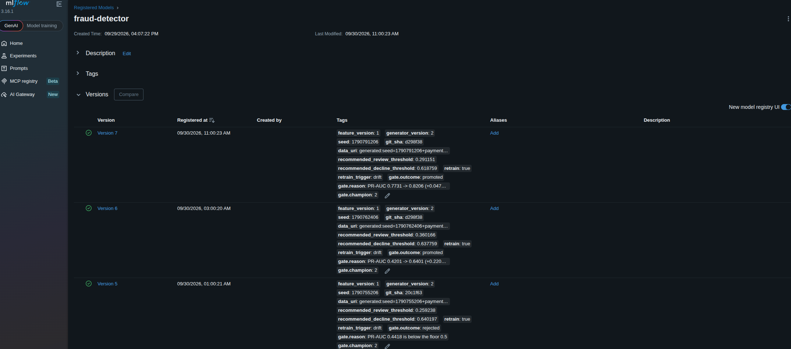
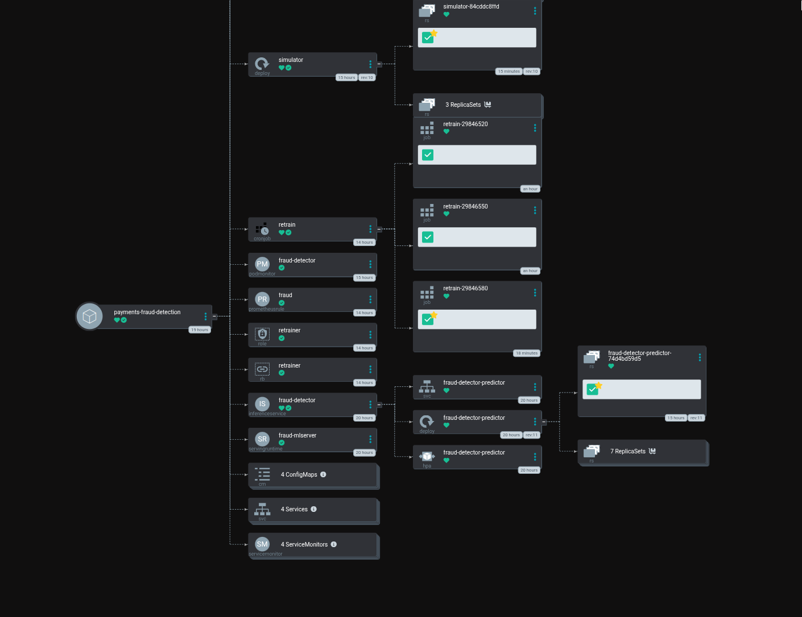

# Payments Fraud Detection

[](https://github.com/jstrebeck/payments-fraud-detection/actions/workflows/ci.yml)
[](LICENSE)
[](pyproject.toml)

An end-to-end MLOps showcase: a synthetic payments platform that scores every
transaction for fraud in real time, with the full lifecycle of the model
(training, tracking, registry, serving, monitoring, retraining) automated and
running on a self-hosted Kubernetes homelab.

**Author:** Josh Strebeck ([@jstrebeck](https://github.com/jstrebeck))
**Status:** all eight phases built. The API runs in the homelab and scores every payment with the `champion` model served by KServe, deployed by Argo CD from `deploy/overlays/homelab`, with dashboards, alerts, correlation IDs, delayed label feedback, drift detection, and alert-driven retraining that promotes only through the evaluation gate. See the walkthrough below. See [ROADMAP.md](ROADMAP.md).
**Note:** the self-hosted GitHub Actions runner is offline for now, so the image build/push and cluster-training workflows are skipped and deploys are run by hand (`make release`, `make train-cluster`). Details in [docs/ci-cd.md](docs/ci-cd.md).
**License:** [MIT](LICENSE)

## What this demonstrates

| Skill area | How it shows up here |
|---|---|
| ML experiment tracking and model registry | MLflow tracking server, model registry with alias-based promotion |
| Model serving | KServe `InferenceService` (RawDeployment mode) pulling versioned artifacts from S3-compatible storage |
| Containerisation and CI | Multi-stage Docker images, GitHub Actions on a self-hosted runner, image push to an in-cluster registry |
| GitOps delivery | Argo CD syncs this repo's `deploy/` overlays into the cluster |
| Observability | Prometheus `ServiceMonitor`s, Grafana dashboards, model-quality and drift metrics |
| Automated retraining | Scheduled training job, evaluation gates, promotion only when the challenger beats the champion |
| Infrastructure as code | Cluster platform components live in the [Homelab-Configuration](https://github.com/jstrebeck/Homelab-Configuration) repo |

## Architecture at a glance


Full description: [docs/architecture.md](docs/architecture.md). The diagram is
`docs/architecture.svg`.

## Walkthrough: one drift, handled end to end

On 2026-09-30 the simulator's traffic was deliberately drifted with a single
Git commit (the `fraud-shift` profile: inflated amounts, more e-commerce, and a
new `session_hijack` fraud pattern the champion had never seen). Everything
after that commit happened without a human. The screenshots cover
06:30 to 10:30 UTC; the stat tiles at the top of each Grafana dashboard show
the live values at capture time, after the drill had been rolled back.

**1. Drift is detected.** The drift monitor compares the last hour of live
feature vectors with the champion's training profile (population stability
index per feature). From about 07:00 the amount and channel features leave
their usual range and `FraudFeatureDrift` fires at 07:54 (red regions are
alerts).



*This capture predates a fix: the "features drifting" count and the baseline
table still include card-history features, which the simulator resets each
pass. After the drill they caused a false alarm, so the alert now counts
population features only (see the incident in ADR-0015).*

**2. The model suffers, and it shows.** On the model dashboard, precision and
recall against the simulator's ground truth fall as the new fraud arrives, and
the flagged share moves inside its 24-hour band. Scoring latency stays flat
(about 17 ms p50, 25 ms p99), and no payment is left undecided.



**3. Retraining, gated.** Every 30 minutes a CronJob asks Prometheus whether
the drift alert is firing. At 08:00 it retrained on labelled live payments
(delayed chargebacks and confirmations), and the gate **rejected** the result:
version 5, PR-AUC 0.44, below the floor. That exposed a real flaw in how live
data was split; it was fixed, and at 10:00 the next run trained version 6,
which the gate promoted (PR-AUC 0.42 to 0.64 on held-out live cards). The
retrain Job then rolled the KServe predictor to it, and the API switched to
version 6 and its own decision thresholds. Every gate verdict is recorded on
the version:



*Times in this capture are US Pacific. Version 7 is the false-alarm promotion
described in ADR-0015; version 2, the original champion, is serving again.*

**4. Everything is declared in Git.** Argo CD owns every object in the
namespace: the API and simulator Deployments, the KServe InferenceService and
serving runtime, the retrain CronJob and its narrowly scoped Role, the
PrometheusRule, ServiceMonitors and the Grafana dashboards themselves.



**5. Back to normal.** The drift commit was reverted, and the previous
champion was put back with the rollback runbook in 18 seconds
(`docs/runbooks/rollback-model.md`). What the drill got wrong, and what was
changed because of it, is written up in
[ADR-0015](docs/adr/0015-automated-retraining.md).

Run the same tour against the live cluster with `scripts/demo.sh`.

## Repository layout

```
services/payments-api/   FastAPI service: accepts payments, calls the fraud model, records decisions
services/simulator/      CLI that generates synthetic traffic against the API (uses ml/data)
ml/data/                 Seeded synthetic transaction generator (single source of truth for the data)
ml/features/             Feature engineering shared by training and online inference
ml/training/             Training entrypoint: trains, evaluates, logs to MLflow, registers the model
ml/evaluation/           Offline evaluation, champion/challenger comparison, promotion gate
ml/serving/              KServe transformer / custom predictor code (only if the MLflow runtime is not enough)
deploy/                  Kustomize manifests for THIS project's workloads (not cluster platform components)
dashboards/              Grafana dashboard JSON, provisioned via ConfigMap
scripts/                 One-off helper scripts (seed data, promote model, smoke tests)
docs/                    Architecture, ADRs, runbooks, homelab integration notes
.github/workflows/       CI (lint/test), image build and push, scheduled training trigger
```

Every directory has its own `README.md` describing what belongs there and what
is expected of it.

## Two-repo split

Anything that is a **cluster platform component** (MLflow server, S3 store,
Postgres, KServe, cert-manager, Argo CD, ingress) is deployed from the
`Homelab-Configuration` repo. This repo only contains **application workloads**
and their manifests. The exact boundary and what needs to be added to the
homelab repo is documented in [docs/homelab-integration.md](docs/homelab-integration.md)
and [ADR-0002](docs/adr/0002-two-repo-boundary.md).

## Getting started

Needs [uv](https://docs.astral.sh/uv/) and Docker Compose.

```
make install     # uv workspace + pre-commit hooks
make check       # ruff, mypy --strict, pytest (what CI runs)
make dev         # postgres + payments-api (MLflow is the homelab server)
make train       # train LightGBM, register it in MLflow
make promote     # promotion gate: move `champion` only if the new model wins
make simulate    # replay synthetic transactions against the API
make smoke       # end-to-end check of a running API
```

Decisions land in Postgres (`make psql`) and metrics at
`http://localhost:8000/metrics`. Details in
[docs/local-development.md](docs/local-development.md).

## Key documents

- [ROADMAP.md](ROADMAP.md): phased plan, current phase, definition of done per phase
- [CLAUDE.md](CLAUDE.md): conventions and instructions for AI coding agents working in this repo
- [docs/architecture.md](docs/architecture.md): system design, data flow, model lifecycle
- [docs/adr/](docs/adr/): decision records (why FastAPI, why synthetic data, why KServe RawDeployment, ...)
- [docs/homelab-integration.md](docs/homelab-integration.md): what already exists in the cluster and what must be added
- [docs/ci-cd.md](docs/ci-cd.md): pipeline design, image tagging, promotion flow
- [docs/model-card-template.md](docs/model-card-template.md): template filled in for every registered model version
